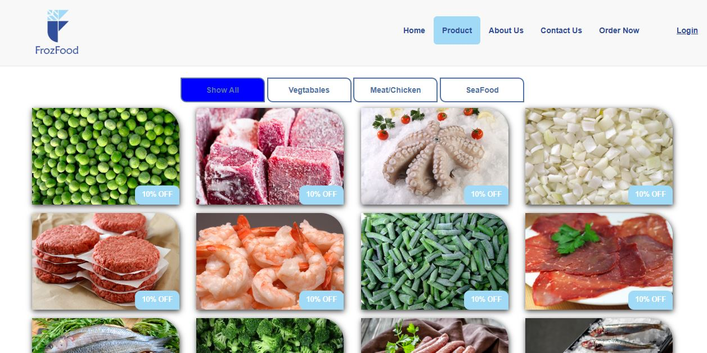

# FrozFood Website
This is a front-end website for a frozen food company that allows customers to browse products and place online orders. The application is built using a combination of HTML, CSS, and JavaScript libraries.

## Getting Started
To get the project running, follow these simple steps:

1. Clone this repository to your local machine.

1. Open any of the HTML files (e.g., Home.html) directly in your preferred web browser. The pages are designed to work locally without a server.

## Features
The website includes the following key features to enhance user experience:

* Dynamic Loader: A custom-built loader that displays a logo animation while the page assets load.

* Responsive Navigation: The navigation menu adapts its style and behavior to provide a seamless experience on both desktop and mobile devices.

* Product Filtering: The product page utilizes a filtering system to allow customers to sort products by category (e.g., vegetables, meat, seafood).

* Smooth Scrolling: The "Contact Us" link provides a smooth animation to navigate to the footer contact section.

* Modal Login: A pop-up login form provides a quick way for users to log in without navigating to a new page.

## Pages
The project consists of six distinct HTML pages:

* Home.html

* product.html

* about us.html

* contact us.html

* login.html

* signup.html

## Technologies and Libraries
This project was built with a variety of front-end tools and libraries to handle styling, layout, and dynamic functionality.

### CSS and Fonts
* Bootstrap: The primary framework used for responsive design and component styling.

* Font Awesome & Glyphicons: Icon libraries used for a wide range of icons, including those for navigation and product details.

* Droidkufi & Quick Sand: Custom font families used for typography to give the site a clean look.

### JavaScript
jQuery: A fast, small, and feature-rich JavaScript library that simplifies DOM manipulation.

* HTML5shiv: A script that enables HTML5 elements in older versions of Internet Explorer.

* Isotope.pkgd.min.js: A jQuery plugin for intelligent layout and filtering of the product items.

### Custom JavaScript Functions
The website's custom logic is contained within a single main script file. Here's a breakdown of the key functions and their purpose:

* Document Ready Function: Ensures that all the JavaScript code is executed only after the HTML document has been fully loaded and parsed.

* Logo Loader Function: Hides the initial loading animation and makes the rest of the page content visible after a 5-second delay.

* Reusable Nav Color Function: A helper function that applies specific CSS styles to the navigation bar when the website is viewed on smaller screens, such as mobile devices.

* Window Resize Handler: Detects when the browser window is resized and adjusts the navigation bar's appearance to be responsive, switching between desktop and mobile styles.

* Login Pop-up Functions: These two functions control the login modal. One fades in the pop-up when the login button is clicked, and the other fades it out when the exit button is clicked.

* Isotope Initialization: This function initializes the Isotope library, which is responsible for the intelligent layout and filtering of the product grid.

* Isotope Click Handler: Manages the product filtering by changing the layout to show only the products that match the selected category. It also updates the active button style.

* Product Button Styling: A series of functions that change the background color of the filter buttons on the product page to indicate which category is currently selected by the user.

* Smooth Scroll: Provides a smooth, animated scroll to the contact us section at the bottom of the page when the corresponding navigation link is clicked.

Screenshots
### Homepage

Product Page

About Us Page

